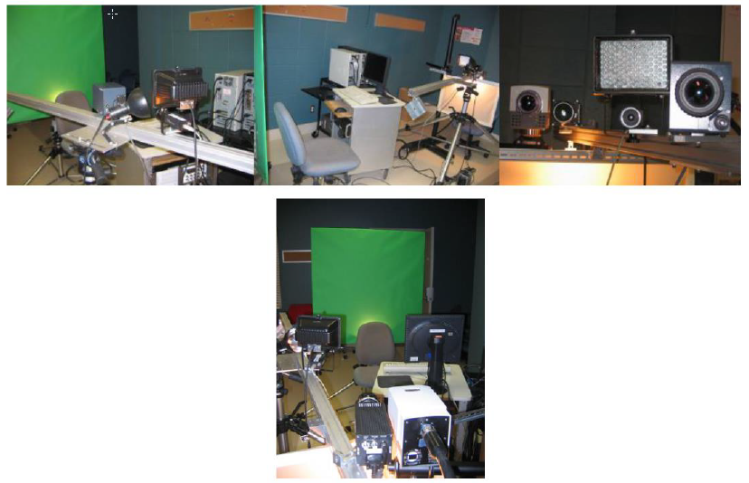
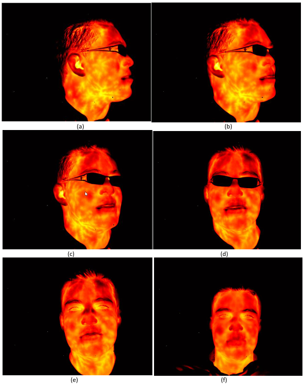
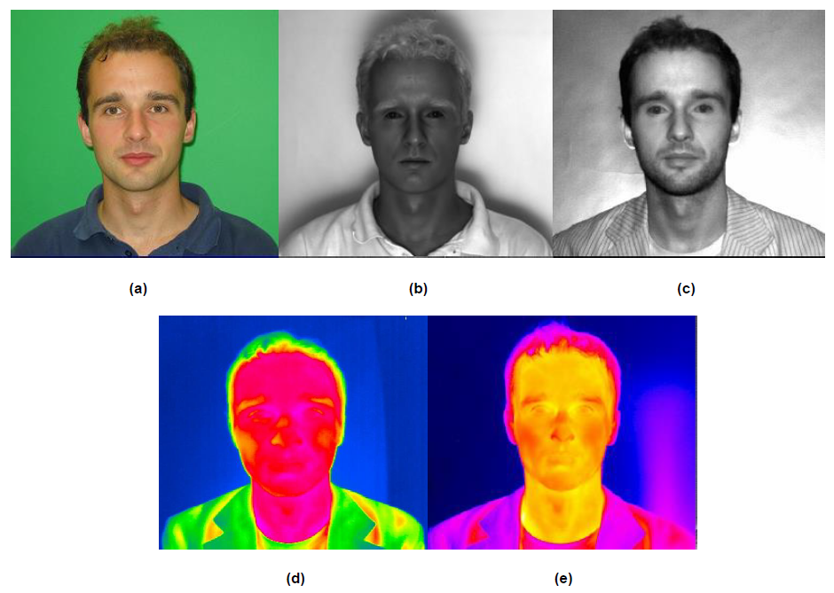

# Université Laval Face Motion and Time-Lapse Video Database (UL-FMTV)

## Authors
Reza Shoja Ghiass, Hakim Bendada, Xavier Maldague  
Computer Vision and Systems Laboratory, Laval University, Quebec City, Canada

## Contact
- reza.shoja@gmail.com
- maldagx@gel.ulaval.ca

## Abstract
The UL-FMTV database is the largest facial video database in the world in the Mid-Wave Infrared (MWIR) spectrum. It was created to address the lack of large-scale, multi-session, time-lapse facial video datasets with diverse subjects (ethnicity, age, sex), poses, and expressions. The database contains high-resolution MWIR videos of 238 subjects, collected over several years, and is available for public research use (non-commercial only).

## Key Features
- **238 subjects**: Diverse in ethnicity, age, and sex
- **MWIR videos**: High-resolution, 3000-5000 nm
- **Multiple sessions**: Data collected over 4 years
- **Wide range of poses and expressions**
- **Includes subjects with and without eyeglasses**
- **Genuine and Impostor folders**: For face recognition and verification tasks
- **Matlab script included**: For easy reading of images and videos
- **License**: [CC BY 4.0](https://creativecommons.org/licenses/by/4.0/deed.en)

## Imaging Setup
The imaging setup used to gather the UL-FMTV face database:

**Cameras used**:
  - LWIR (Jenoptik, 8000-14000 nm)
  - MWIR (Phoenix Indigo IR, FLIR, 3000-5000 nm)
  - SWIR (Goodrich, 900-1700 nm)
  - NIR/Visible (Mutech, 750-1100 nm)
**Available data**: Only MWIR images/videos are publicly available
**Sessions**: Multiple sessions per subject, with variations in time-lapse, pose, expression, eyeglasses, and temperature

## Database Structure
- `Genuine/`: 134 subjects (86 males, 48 females), some with multiple sessions and eyeglasses
- `Impostor/`: 104 subjects, for verification scenarios
- **Performance metrics**: CMC and ROC curves can be calculated

## Usage
 - For research and non-commercial use only
 - [Download the database here](http://vision.gel.ulaval.ca/~ThermalFaces/Restricted/ThermalFaces.zip)
 - Matlab script provided for reading data

## Database Webpage
 [Visit the official database webpage](http://vision.gel.ulaval.ca/~ThermalFaces/)

## Applications

## Sample from the Dataset

Below is a sample from the UL-FMTV database after time-lapse, demonstrating the diversity of poses, accessories, and time-lapse scenarios:

(a) extreme pose with glasses, (b) pose with glasses, (c) mid-profile with glasses, (d) frontal with glasses, (e) frontal, and (f) frontal view after 23 months.

## Imaging Modalities Example

Below is an example of a subject from UL-FMTV captured in different imaging modalities:

(a) Visible, (b) SWIR, (c) NIR, (d) LWIR, and (e) MWIR

## Citation
If you use this database, please cite:

Shoja Ghiass, R., Bendada, H., Maldague, X. "Université Laval Face Motion and Time-Lapse Video Database (UL-FMTV)", 14th Quantitative InfraRed Thermography Conference, Berlin, Germany, 2018.

---

